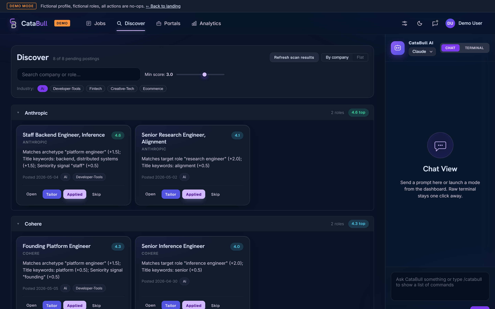

<div align="center">

# CataBull

Your local-first AI job search command center.

[Install](#install) | [Features](#features) | [Docs](docs/README.md) | [Setup](docs/guides/SETUP.md) | [Security](SECURITY.md)

[](https://nodejs.org/)
[](https://playwright.dev/)
[](https://fastify.dev/)
[](LICENSE)
[](#features)

[](https://docs.anthropic.com/en/docs/claude-code/overview)
[](https://github.com/openai/codex)
[](https://opencode.ai/)
[](https://github.com/google-gemini/gemini-cli)
[](https://github.com/NousResearch/hermes-agent)
[](https://docs.openclaw.ai/install/index)



Live site: [catabull landing page](https://nerdywhiskers.github.io/CataBull/)

</div>

CataBull is a local-first dashboard, scanner, evaluator, and tailored application bundle generator for serious job searches. It works with Claude Code, Codex, OpenCode, Gemini, Hermes, and OpenClaw, while keeping your CV, target list, reports, and application history on your machine.

## Install

**One-line install** - run the command in the terminal, which bootstraps Node 18+ via [`fnm`](https://github.com/Schniz/fnm) if you do not already have it, then installs CataBull and runs first-run setup. 

```bash
# macOS / Linux
curl -fsSL https://nerdywhiskers.github.io/CataBull/install.sh | bash
```

```powershell
# Windows (PowerShell)
irm https://nerdywhiskers.github.io/CataBull/install.ps1 | iex
```

Then run `catabull` and open <http://localhost:3737>. First run scaffolds a workspace at `~/.catabull/` and installs Playwright Chromium into your user cache.

**Prefer to see what you are running?** If you already have Node 18+ installed:

```bash
# One-shot - runs CataBull without a permanent install
npx github:nerdywhiskers/CataBull

# Or install once and reuse
npm install -g github:nerdywhiskers/CataBull
catabull
```

The CLI also accepts subcommands:

```bash
catabull setup          # bootstrap first-run dependencies, then run doctor
catabull doctor         # validate setup
catabull scan           # zero-token portal scan
catabull scan-health    # health-check tracked companies
catabull verify         # pipeline integrity check
catabull --help
```

### From Source

```bash
git clone https://github.com/nerdywhiskers/CataBull.git
cd CataBull
npm install
npm run dashboard
```

Workspace defaults to the cloned directory so your data stays where the code is.

## Supported CLI Agents (Pre-requisite)

Onboarding requires a working CLI agent on `PATH`; the wizard asks you to pick one and optionally run a quick test before continuing. Tip: You can also ask your agent to install CataBull for you and serve it on your local network. Tailscale support is included. 

| Agent | Install hint |
| --- | --- |
| Claude Code | `npm install -g @anthropic-ai/claude-code` |
| Codex CLI | See [github.com/openai/codex](https://github.com/openai/codex) |
| OpenCode | `npm install -g opencode-ai` |
| Gemini CLI | `npm install -g @google/gemini-cli` |
| Hermes Agent | `curl -fsSL https://raw.githubusercontent.com/NousResearch/hermes-agent/main/scripts/install.sh \| bash` or see [NousResearch/hermes-agent](https://github.com/NousResearch/hermes-agent) |
| OpenClaw | `npm install -g openclaw@latest` or see [OpenClaw install docs](https://docs.openclaw.ai/install/index) |

## Features

| Feature | What it does |
| --- | --- |
| Discover | Card grid of current postings across tracked portals, sorted by fit score with rationale on every card |
| Tailor bundle | One click creates a tailored CV, cover letter, and 5-8 application Q&A from `cv.md` and `config/profile.yml` |
| Verified discovery | Onboarding proposes companies, verifies careers URLs, and role-fit checks them before saving to `portals.yml` |
| URL recovery | One-click "Find new URL" flow for auto-disabled companies |
| ATS providers | Greenhouse, Ashby, Lever, Workday, BambooHR, and Teamtailor through direct APIs where possible |
| Health monitoring | Periodic portal health checks with auto-disable after repeated failures |
| Deep evaluation | A-E rubric for CV match, level strategy, compensation research, cultural fit, and red flags |
| Integrated terminal | Claude Code, Codex, OpenCode, Gemini, Hermes, or OpenClaw session docked inside the dashboard |
| Local-first | No telemetry; your CV, applications, reports, and target list stay on disk |

## Stack

- **Frontend:** vanilla JS + CSS, zero build step
- **Backend:** Fastify
- **Terminal:** xterm.js + node-pty over WebSocket
- **Scanner:** direct API calls to ATS providers, plus WebSearch fallback
- **PDF:** Playwright headless Chromium
- **Data:** Markdown, YAML, TSV, and JSON on disk

## Workspace Layout

```text
~/.catabull/
|-- cv.md                      Your CV in Markdown
|-- config/profile.yml         Target roles, narrative, archetypes
|-- modes/_profile.md          Adaptive framing rules
|-- portals.yml                Tracked companies and filters
|-- data/
|   |-- applications.md        Application tracker
|   `-- pipeline.md            Pending URLs
|-- reports/                   Evaluation reports
`-- output/
    `-- tailor-bundles/        Per-role CV / cover letter / Q&A
```

## Documentation

Start at [docs/README.md](docs/README.md) for the doc index. Highlights:

- [Design](docs/design/) - `ARCHITECTURE.md`, `WORKSPACE_AND_PROFILES.md`, and `MARKET_DISCOVERY.md`
- [Guides](docs/guides/) - `SETUP.md`, `CUSTOMIZATION.md`, and `SCRIPTS.md`

## Backup And Sync

If you want your data versioned, fork this repo and repoint your local workspace at the fork. Dashboard works identically with or without a fork; your data is on disk either way.

## Attribution

CataBull is an independent project derived from [career-ops](https://github.com/santifer/career-ops), created by Santiago Fernandez de Valderrama. CataBull is not affiliated with, sponsored by, or endorsed by career-ops.

CataBull also credits [JobSpy](https://github.com/speedyapply/JobSpy), the Python job scraping library used as a reference for broader job-board discovery patterns.

## License

MIT - see [LICENSE](LICENSE).
